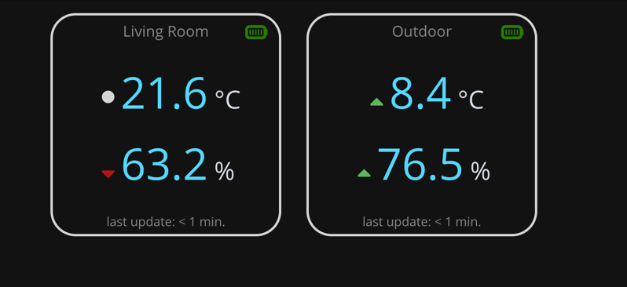

# Smarthome
The Smarthome app provides a user-friendly interface to quickly access information
of several smart sensors deployed in your network.

Next to the sensor overview, Smarthome allows users to create Smartviews.
Smartviews are customizable views of different sensor display types (e.g. text-only, simple, detailed). 

## Sensor Control Center - SCC

The Sensor Control Center provides the user with an overview of available sensors and their type.
Users can see if they are active, their current battery status and what information they provide.
Sensors can be activated or deactivated for being used in other parts of the application.

## Smartview
Smartviews are customizable views the user can setup to their requirements. They offer view components,
such as a carousel to slide through different sensor views and a detail component, that shows information of
a dedicated sensor. Detail components can be configured to show sensor information as text-only, a simple and an advanced view configuration.
