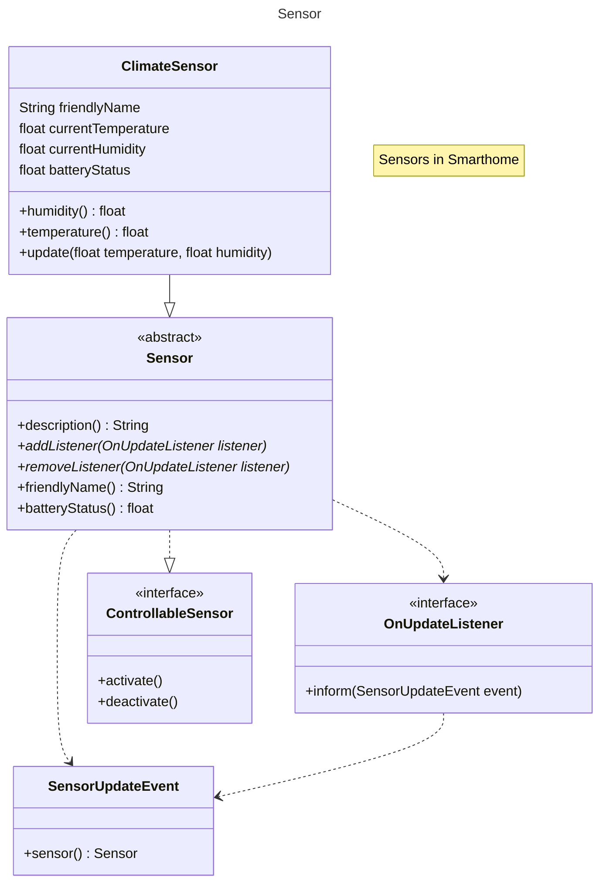
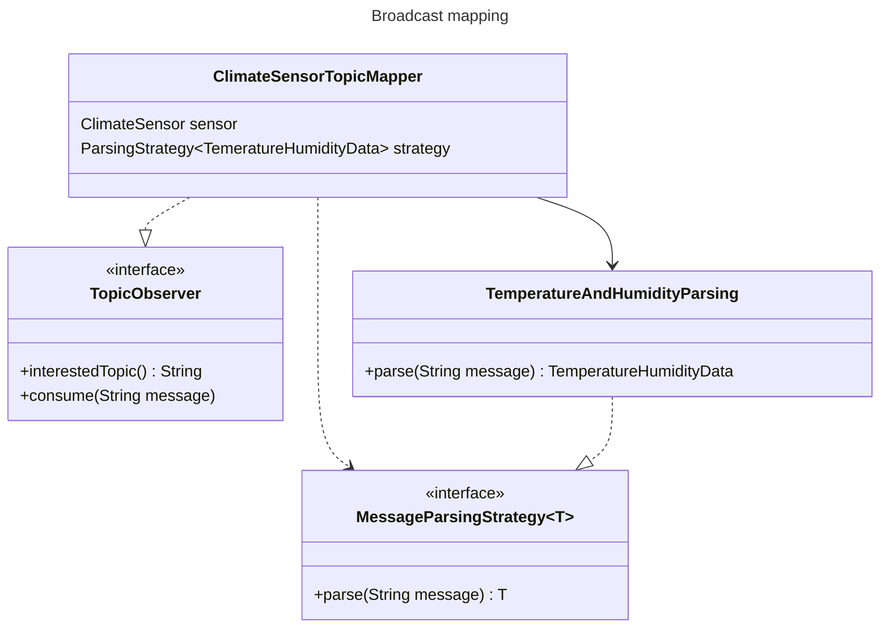

# Sensor class diagram



## Sensor value update



## Sensor `.yml` config file
Sensors can be configured via an external `sensor.yml` file, with the following structure.

```yaml
sensors:
  - friendly_name: home/living_room/climate
    type: temperature_humidity
    id: 0x00128d0001d9e1d2
    
  - friendly_name: home/dormitory/climate
    type: temperature_humidity
    id: 0xXXXXXXXXXXXXXXX
```

__Supported values for `type`__:
 
- `temperature_humidity` (Temperature and humidity sensor) 
